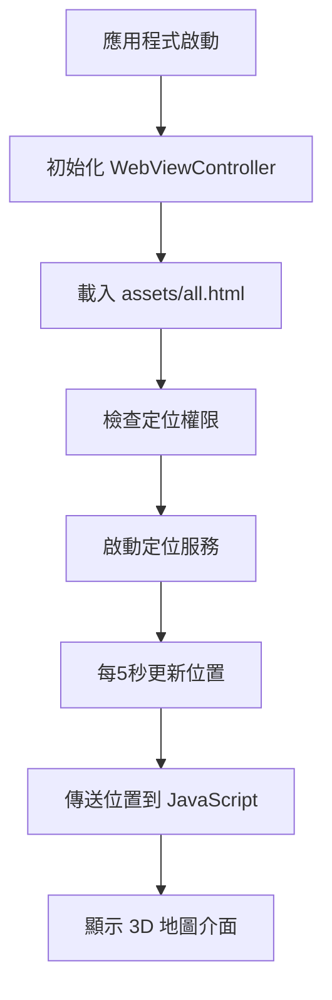
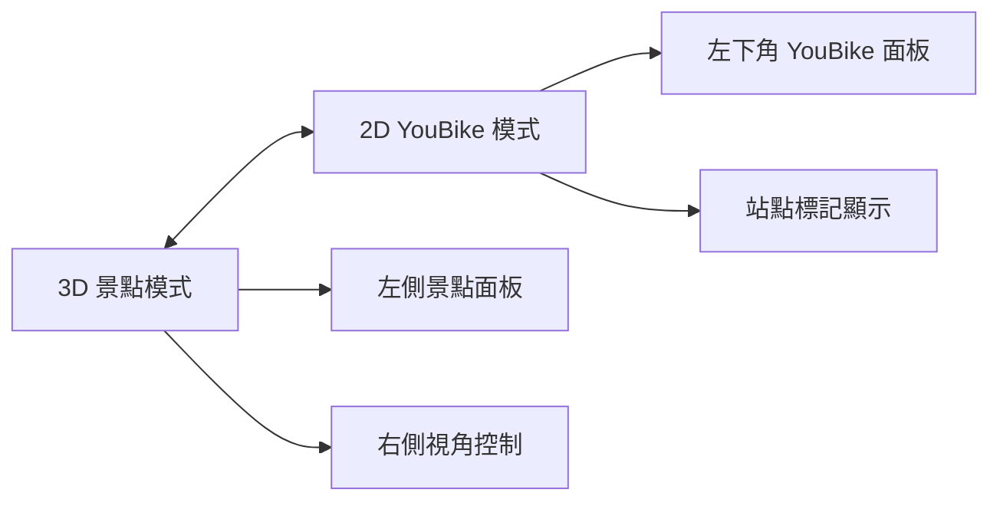
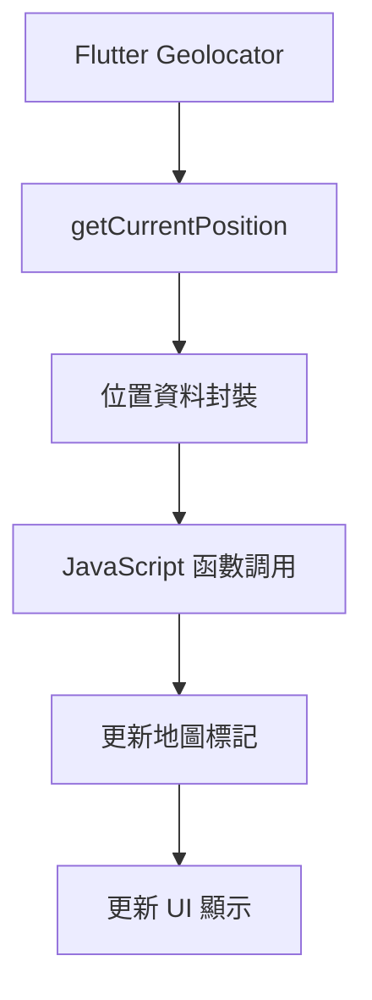

# 台中景點 3D 地圖專案文檔

## 📋 專案概覽

**專案名稱**: 台中景點 3D 地圖 (fmap)
**技術棧**: Flutter + Google Maps 3D API + WebView + HTML5
**支援平台**: iOS, Android, Web, macOS
**主要功能**: 3D 景點導覽、YouBike 站點查詢、即時定位

---

## 🏗️ 專案架構

### 📁 目錄結構
```
fmap/
├── lib/
│   ├── main.dart                 # 主程式入口
│   └── webview_map.dart         # WebView 地圖組件
├── assets/
│   ├── all.html                 # 完整功能地圖 (3D+2D+YouBike)
│   ├── map1.html                # 3D 景點地圖
│   └── favicon.svg              # 網站圖示
├── images/
│   ├── taichung.gif            # 台中動畫圖示
│   └── image1-9.jpeg           # 景點圖片
├── android/                    # Android 平台配置
├── ios/                        # iOS 平台配置
├── macos/                      # macOS 平台配置
├── web/                        # Web 平台配置
└── pubspec.yaml               # Flutter 專案配置
```

### 🔧 核心組件

#### 1. Flutter 主程式 (`lib/main.dart`)
- **功能**: 應用程式入口點、WebView 控制器
- **關鍵特性**:
  - 跨平台 WebView 載入
  - GPS 定位服務整合
  - 每 5 秒自動位置更新
  - JavaScript 與 Flutter 雙向通訊

#### 2. HTML 地圖引擎 (`assets/all.html`)
- **功能**: 主要地圖介面，支援 3D 和 2D 模式
- **關鍵特性**:
  - Google Maps 3D API 整合
  - YouBike 2.0 即時資料
  - 響應式面板設計
  - 跨平台兼容性

---

## 🚀 功能模組

### 🗺️ 3D 景點導覽
- **8 個台中知名景點**:
  - 台中市政府
  - 國立自然科學博物館
  - 台中公園
  - 彩虹眷村
  - 秋紅谷廣場
  - 高美濕地
  - 東海大學路思義教堂
  - 一中街商圈

- **互動功能**:
  - 3D 飛行動畫
  - 360° 環景旋轉
  - 仰角/高度調整
  - 景點資訊展示

### 🚲 YouBike 2.0 整合
- **即時資料來源**: 台中市政府開放資料 API
- **功能特性**:
  - 1194+ 站點即時狀態
  - 可借/可還車輛數顯示
  - 距離/步行時間計算
  - 搜尋半徑可調整 (500m-5000m)
  - 站點圖標大小可調整

### 📍 智能定位系統
- **定位技術**:
  - Flutter Geolocator 整合
  - 高精度 GPS 定位
  - 自動位置更新 (5 秒間隔)
  - 跨平台位置傳遞

- **視覺指示**:
  - 藍色圓點標記使用者位置
  - 脈動效果提升可見度
  - 定位資訊面板 (可摺疊)
  - 紅色定位按鈕 (左下角)

---

## 🔄 程式流程

### 🚀 應用程式啟動流程


### 🗺️ 地圖模式切換


### 📍 定位資料流


---

## 🎯 核心功能實現

### 1. 跨平台資源載入
**問題**: macOS 路徑解析嚴格，圖片載入失敗
**解決方案**:
```javascript
// 智能路徑嘗試機制
const pathsToTry = [
    '../images/taichung.gif',    // iOS/Android/Web
    'images/taichung.gif',       // macOS 兼容
    './images/taichung.gif',     // 備用路徑
    '/images/taichung.gif'       // 絕對路徑
];
```

### 2. Flutter ↔ JavaScript 通訊
**位置資料傳遞**:
```dart
// Flutter 端
String jsCode = '''
  window.flutterLocationData = {
    lat: ${position.latitude},
    lng: ${position.longitude},
    accuracy: ${position.accuracy}
  };
  if (window.receiveFlutterLocation) {
    window.receiveFlutterLocation(window.flutterLocationData);
  }
''';
await _controller.runJavaScript(jsCode);
```

```javascript
// JavaScript 端
window.receiveFlutterLocation = function(locationData) {
  currentUserPosition = {
    lat: locationData.lat,
    lng: locationData.lng
  };
  updateUserLocationMarker(locationData);
};
```

### 3. 響應式 UI 設計
**面板管理系統**:
- 左側面板: 景點導覽 (3D 模式)
- 右側面板: 視角控制 (3D 模式)
- 左下面板: YouBike 控制 (2D 模式)
- 可摺疊/展開設計
- 觸控友善的按鈕尺寸

---

## 📱 平台特性

### iOS
- **特殊配置**: Info.plist 定位權限描述
- **測試狀態**: ✅ 正常運作
- **特色功能**: 原生定位整合

### Android
- **特殊配置**: 位置權限設定
- **測試狀態**: ✅ 正常運作
- **特色功能**: Google Play Services 整合

### Web
- **特殊配置**: CORS 處理、API 金鑰管理
- **測試狀態**: ✅ 正常運作
- **特色功能**: 瀏覽器 Geolocation API 備用

### macOS
- **特殊配置**: 
  - 沙盒權限 (entitlements)
  - 圖片路徑修正機制
- **測試狀態**: ✅ 正常運作 (經修正)
- **特色功能**: 桌面原生體驗

---

## 🔧 技術細節

### Google Maps 3D API 整合
```javascript
// 3D 地圖初始化
const { Map3DElement, Marker3DInteractiveElement } = 
    await google.maps.importLibrary("maps3d");

map3D = new Map3DElement({
    center: { lat: 24.147736, lng: 120.673648, altitude: 2000 },
    range: 30000,
    tilt: 30,
    mode: MapMode.HYBRID
});
```

### YouBike API 資料處理
```javascript
// 即時資料載入
async function loadYouBikeDataNormalized() {
    const apiUrl = 'https://datacenter.taichung.gov.tw/swagger/OpenData/bc27c2f7-6ed7-4f1a-b3cc-1a3cc9cda34e';
    const response = await fetch(apiUrl, { cache: 'no-store' });
    const data = await response.json();
    
    // 資料正規化處理
    return data.retVal.map(station => ({
        id: station.sno,
        name: cleanStationName(station.sna),
        lat: Number(station.lat),
        lng: Number(station.lng),
        bikes: Number(station.sbi),
        docks: Number(station.bemp),
        isActive: station.act === 1
    }));
}
```

---

## 🎨 UI/UX 設計

### 色彩配置
- **主色調**: 台中藍 (`#222296`)
- **輔助色**: 淡黃金 (`#EEE8AA`)
- **狀態色**: 
  - 正常: `#34a853` (綠)
  - 警告: `#f29900` (橙)
  - 錯誤: `#d93025` (紅)

### 互動設計
- **按鈕回饋**: Hover 效果 + 縮放動畫
- **面板切換**: 滑動動畫 (0.3s ease)
- **地圖操作**: 飛行動畫 + 環景旋轉
- **觸控優化**: 44px 最小觸控區域

---

## 📊 效能優化

### 資料載入優化
- YouBike 資料快取機制
- 圖片懶載入
- API 請求節流 (35 秒間隔)

### 渲染優化
- 地圖標記聚合
- 視窗範圍內站點篩選
- DOM 操作最小化

### 記憶體管理
- Timer 自動清理
- 事件監聽器移除
- WebView 生命週期管理

---

## 🚨 問題解決記錄

### 1. macOS 圖片載入問題
**問題**: 圖片路徑解析失敗
**解決**: 多路徑嘗試機制 + 沙盒權限設定

### 2. Flutter Web JavaScript 執行
**問題**: runJavaScript 在 Web 平台限制
**解決**: 多種執行方法備用策略

### 3. 跨平台定位整合
**問題**: 各平台定位 API 差異
**解決**: 統一介面 + 平台特定實現

---

## 🔮 未來發展

### 功能擴展
- [ ] 路線規劃功能
- [ ] 景點評分系統
- [ ] 社群分享功能
- [ ] 離線地圖支援

### 技術升級
- [ ] Flutter 3.x 遷移
- [ ] Google Maps API 最新版本
- [ ] PWA 支援增強
- [ ] 效能監控整合

---

## 📝 開發筆記

### 重要學習點
1. **WebView 跨平台差異**: 各平台對 JavaScript 執行和資源載入的不同處理
2. **路徑解析策略**: 相對路徑在不同環境下的行為差異
3. **定位服務整合**: GPS 精度vs電量消耗的平衡
4. **UI 響應式設計**: 同一介面適配多種螢幕尺寸

### 最佳實踐
- 漸進式增強: 基礎功能優先，增強功能可選
- 錯誤處理: 預期失敗情況並提供備用方案
- 效能監控: 關鍵操作的載入時間追蹤
- 用戶體驗: 即時回饋 + 狀態指示

---

**專案完成日期**: 2025年
**維護狀態**: 🟢 積極維護中
**聯絡資訊**: mtc98@me.com  by Thomas  Mei  2025/09/26