# 台中景點 3D 地圖專案文檔

## 📋 專案概覽

**專案名稱**: 台中景點 3D 地圖 (fmap)
**技術棧**: Flutter + Google Maps 3D API + WebView + HTML5
**支援平台**: iOS, Android, Web, macOS
**主要功能**: 3D 景點導覽、YouBike 站點查詢、即時定位

---

## 🏗️ 專案架構

### 📁 目錄結構
```
fmap/
├── lib/
│   ├── main.dart                 # 主程式入口
│   └── webview_map.dart         # WebView 地圖組件
├── assets/
│   ├── all.html                 # 完整功能地圖 (3D+2D+YouBike)
│   ├── map1.html                # 3D 景點地圖
│   └── favicon.svg              # 網站圖示
├── images/
│   ├── taichung.gif            # 台中動畫圖示
│   └── image1-9.jpeg           # 景點圖片
├── android/                    # Android 平台配置
├── ios/                        # iOS 平台配置
├── macos/                      # macOS 平台配置
├── web/                        # Web 平台配置
└── pubspec.yaml               # Flutter 專案配置
```

### 🔧 核心組件

#### 1. Flutter 主程式 (`lib/main.dart`)
- **功能**: 應用程式入口點、WebView 控制器
- **關鍵特性**:
  - 跨平台 WebView 載入
  - GPS 定位服務整合
  - 每 5 秒自動位置更新
  - JavaScript 與 Flutter 雙向通訊

#### 2. HTML 地圖引擎 (`assets/all.html`)
- **功能**: 主要地圖介面，支援 3D 和 2D 模式
- **關鍵特性**:
  - Google Maps 3D API 整合
  - YouBike 2.0 即時資料
  - 響應式面板設計
  - 跨平台兼容性

---

## 🚀 功能模組

### 🗺️ 3D 景點導覽
- **8 個台中知名景點**:
  - 台中市政府
  - 國立自然科學博物館
  - 台中公園
  - 彩虹眷村
  - 秋紅谷廣場
  - 高美濕地
  - 東海大學路思義教堂
  - 一中街商圈

- **互動功能**:
  - 3D 飛行動畫
  - 360° 環景旋轉
  - 仰角/高度調整
  - 景點資訊展示

### 🚲 YouBike 2.0 整合
- **即時資料來源**: 台中市政府開放資料 API
- **功能特性**:
  - 1194+ 站點即時狀態
  - 可借/可還車輛數顯示
  - 距離/步行時間計算
  - 搜尋半徑可調整 (500m-5000m)
  - 站點圖標大小可調整

### 📍 智能定位系統
- **定位技術**:
  - Flutter Geolocator 整合
  - 高精度 GPS 定位
  - 自動位置更新 (5 秒間隔)
  - 跨平台位置傳遞

- **視覺指示**:
  - 藍色圓點標記使用者位置
  - 脈動效果提升可見度
  - 定位資訊面板 (可摺疊)
  - 紅色定位按鈕 (左下角)

---

## 🔄 程式流程

### 🚀 應用程式啟動流程

```mermaid
graph TD
    A[應用程式啟動] --> B[初始化 WebViewController]
    B --> C[載入 assets/all.html]
    C --> D[檢查定位權限]
    D --> E[啟動定位服務]
    E --> F[每5秒更新位置]
    F --> G[傳送位置到 JavaScript]
    G --> H[顯示 3D 地圖介面]
```


### 🗺️ 地圖模式切換

```mermaid
graph LR
    A[3D 景點模式] <--> B[2D YouBike 模式]
    A --> C[左側景點面板]
    A --> D[右側視角控制]
    B --> E[左下角 YouBike 面板]
    B --> F[站點標記顯示]
```


### 📍 定位資料流

```mermaid
graph TD
    A[Flutter Geolocator] --> B[getCurrentPosition]
    B --> C[位置資料封裝]
    C --> D[JavaScript 函數調用]
    D --> E[更新地圖標記]
    E --> F[更新 UI 顯示]
```


---

## 🎯 核心功能實現

### 1. 跨平台資源載入
**問題**: macOS 路徑解析嚴格，圖片載入失敗
**解決方案**:
```javascript
// 智能路徑嘗試機制
const pathsToTry = [
    '../images/taichung.gif',    // iOS/Android/Web
    'images/taichung.gif',       // macOS 兼容
    './images/taichung.gif',     // 備用路徑
    '/images/taichung.gif'       // 絕對路徑
];
```

### 2. Flutter ↔ JavaScript 通訊
**位置資料傳遞**:
```dart
// Flutter 端
String jsCode = '''
  window.flutterLocationData = {
    lat: ${position.latitude},
    lng: ${position.longitude},
    accuracy: ${position.accuracy}
  };
  if (window.receiveFlutterLocation) {
    window.receiveFlutterLocation(window.flutterLocationData);
  }
''';
await _controller.runJavaScript(jsCode);
```

```javascript
// JavaScript 端
window.receiveFlutterLocation = function(locationData) {
  currentUserPosition = {
    lat: locationData.lat,
    lng: locationData.lng
  };
  updateUserLocationMarker(locationData);
};
```

### 3. 響應式 UI 設計
**面板管理系統**:
- 左側面板: 景點導覽 (3D 模式)
- 右側面板: 視角控制 (3D 模式)
- 左下面板: YouBike 控制 (2D 模式)
- 可摺疊/展開設計
- 觸控友善的按鈕尺寸

---

## 📱 平台特性

### iOS
- **特殊配置**: Info.plist 定位權限描述
- **測試狀態**: ✅ 正常運作
- **特色功能**: 原生定位整合

### Android
- **特殊配置**: 位置權限設定
- **測試狀態**: ✅ 正常運作
- **特色功能**: Google Play Services 整合

### Web
- **特殊配置**: CORS 處理、API 金鑰管理
- **測試狀態**: ✅ 正常運作
- **特色功能**: 瀏覽器 Geolocation API 備用

### macOS
- **特殊配置**: 
  - 沙盒權限 (entitlements)
  - 圖片路徑修正機制
- **測試狀態**: ✅ 正常運作 (經修正)
- **特色功能**: 桌面原生體驗

---

## 🔧 技術細節

### Google Maps 3D API 整合
```javascript
// 3D 地圖初始化
const { Map3DElement, Marker3DInteractiveElement } = 
    await google.maps.importLibrary("maps3d");

map3D = new Map3DElement({
    center: { lat: 24.147736, lng: 120.673648, altitude: 2000 },
    range: 30000,
    tilt: 30,
    mode: MapMode.HYBRID
});
```

### YouBike API 資料處理
```javascript
// 即時資料載入
async function loadYouBikeDataNormalized() {
    const apiUrl = 'https://datacenter.taichung.gov.tw/swagger/OpenData/bc27c2f7-6ed7-4f1a-b3cc-1a3cc9cda34e';
    const response = await fetch(apiUrl, { cache: 'no-store' });
    const data = await response.json();
    
    // 資料正規化處理
    return data.retVal.map(station => ({
        id: station.sno,
        name: cleanStationName(station.sna),
        lat: Number(station.lat),
        lng: Number(station.lng),
        bikes: Number(station.sbi),
        docks: Number(station.bemp),
        isActive: station.act === 1
    }));
}
```

---

## 🎨 UI/UX 設計

### 色彩配置
- **主色調**: 台中藍 (`#222296`)
- **輔助色**: 淡黃金 (`#EEE8AA`)
- **狀態色**: 
  - 正常: `#34a853` (綠)
  - 警告: `#f29900` (橙)
  - 錯誤: `#d93025` (紅)

### 互動設計
- **按鈕回饋**: Hover 效果 + 縮放動畫
- **面板切換**: 滑動動畫 (0.3s ease)
- **地圖操作**: 飛行動畫 + 環景旋轉
- **觸控優化**: 44px 最小觸控區域

---

## 📊 效能優化

### 資料載入優化
- YouBike 資料快取機制
- 圖片懶載入
- API 請求節流 (35 秒間隔)

### 渲染優化
- 地圖標記聚合
- 視窗範圍內站點篩選
- DOM 操作最小化

### 記憶體管理
- Timer 自動清理
- 事件監聽器移除
- WebView 生命週期管理

---

## 🚨 問題解決記錄

### 1. macOS 圖片載入問題
**問題**: 圖片路徑解析失敗
**解決**: 多路徑嘗試機制 + 沙盒權限設定

### 2. Flutter Web JavaScript 執行
**問題**: runJavaScript 在 Web 平台限制
**解決**: 多種執行方法備用策略

### 3. 跨平台定位整合
**問題**: 各平台定位 API 差異
**解決**: 統一介面 + 平台特定實現

---

## 🔮 未來發展

### 功能擴展
- [ ] 路線規劃功能
- [ ] 景點評分系統
- [ ] 社群分享功能
- [ ] 離線地圖支援

### 技術升級
- [ ] Flutter 3.x 遷移
- [ ] Google Maps API 最新版本
- [ ] PWA 支援增強
- [ ] 效能監控整合

---

## 📝 開發筆記

### 重要學習點
1. **WebView 跨平台差異**: 各平台對 JavaScript 執行和資源載入的不同處理
2. **路徑解析策略**: 相對路徑在不同環境下的行為差異
3. **定位服務整合**: GPS 精度vs電量消耗的平衡
4. **UI 響應式設計**: 同一介面適配多種螢幕尺寸

### 最佳實踐
- 漸進式增強: 基礎功能優先，增強功能可選
- 錯誤處理: 預期失敗情況並提供備用方案
- 效能監控: 關鍵操作的載入時間追蹤
- 用戶體驗: 即時回饋 + 狀態指示

---

## 🌐 GitHub 部署資訊

### 📦 Repository 資訊
- **GitHub 帳號**: mtc98tw@gmail.com
- **Repository 名稱**: taichung-3d-map
- **Repository URL**: `https://github.com/[您的用戶名]/taichung-3d-map`
- **線上展示網址**: `https://[您的用戶名].github.io/taichung-3d-map`

### 🚀 部署流程

#### 方法1: 自動化腳本部署 (推薦)

**Mac/Linux 系統：**
```bash
# 直接執行自動化腳本
./deploy_github.sh

# 或指定不同的 repository 名稱
./deploy_github.sh my-custom-repo-name
```

**Windows 系統：**
```batch
# 直接執行自動化腳本
deploy_github.bat

# 或指定不同的 repository 名稱
deploy_github.bat my-custom-repo-name
```

**腳本功能：**
- ✅ 自動檢查和初始化 Git
- ✅ 自動設定用戶資訊 (mtc98tw@gmail.com)
- ✅ 自動提交目前變更
- ✅ 自動建立 Flutter Web 版本
- ✅ 自動建立和管理 gh-pages 分支
- ✅ 自動推送到 GitHub
- ✅ 彩色輸出和錯誤處理
- ✅ 完整的進度提示

#### 方法2: 手動命令部署

```bash
# 1. 初始化 Git 並設定用戶資訊
git init
git config user.email "mtc98tw@gmail.com"
git config user.name "mtc98tw"
git branch -M main

# 2. 建立主分支並提交所有檔案
git add .
git commit -m "Initial commit: 台中景點3D地圖專案 - 支援iOS/Android/Web/macOS平台"

# 3. 建立並編譯 Web 版本
flutter build web --release

# 4. 建立 GitHub Pages 部署分支
git checkout -b gh-pages
cp -r build/web/* .
git add .
git commit -m "Deploy: GitHub Pages 部署 - 台中景點3D地圖Web版本"
git checkout main

# 5. 推送到 GitHub (需要先在 GitHub 建立 Repository)
git remote add origin https://github.com/mtc98tw/taichung-3d-map.git
git push -u origin main
git push origin gh-pages
```

### 📋 GitHub Repository 建立步驟

#### Step 1: 建立 GitHub Repository
1. **前往 GitHub**：https://github.com/new
2. **登入帳號**：使用 mtc98tw@gmail.com
3. **Repository 設定**：
   - Repository name: `taichung-3d-map`
   - Description: `台中景點3D地圖 - Flutter Web應用，支援3D景點導覽和YouBike站點查詢`
   - Visibility: **Public** (GitHub Pages 免費版本需要)
   - **不要勾選** "Add a README file" (因為本地已有檔案)
   - **不要勾選** "Add .gitignore" (已存在)
   - **不要勾選** "Choose a license" (可稍後添加)
4. **點擊 "Create repository"**

#### Step 2: 執行部署
```bash
# 使用自動化腳本 (推薦)
./deploy_github.sh

# 或使用手動命令
git remote add origin https://github.com/mtc98tw/taichung-3d-map.git
git push -u origin main
git push origin gh-pages
```

### ⚙️ GitHub Pages 設定
1. **前往 Repository 設定頁面**：
   - 在您的 Repository 頁面點擊 **"Settings"** 標籤
2. **找到 Pages 設定**：
   - 在左側選單中找到並點擊 **"Pages"**
3. **配置部署來源**：
   - Source: 選擇 **"Deploy from a branch"**
   - Branch: 選擇 **"gh-pages"**
   - Folder: 選擇 **"/ (root)"**
4. **儲存設定**：
   - 點擊 **"Save"** 按鈕
5. **等待部署**：
   - 通常需要 2-3 分鐘處理
   - 頁面會顯示部署狀態和網址

### 🔄 更新部署流程

#### 使用自動化腳本更新 (推薦)
```bash
# 一鍵更新和重新部署
./deploy_github.sh
```

#### 手動更新流程
```bash
# 當有程式碼更新時：
# 1. 更新主分支
git add .
git commit -m "更新: [描述變更內容]"
git push origin main

# 2. 重新建立 Web 版本並部署
flutter build web --release
git checkout gh-pages
rm -rf !(.|.git)  # 清除舊檔案 (保留 .git)
cp -r build/web/* .
git add .
git commit -m "Deploy: 更新網站部署"
git push origin gh-pages
git checkout main
```

### 🚨 故障排除與常見問題

#### 問題1: 推送失敗 - 認證問題
**症狀**：`git push` 時出現 403 或認證錯誤
**解決方案**：
```bash
# 設定個人存取權杖 (Personal Access Token)
# 1. 前往 GitHub → Settings → Developer settings → Personal access tokens
# 2. 產生新權杖，勾選 "repo" 權限
# 3. 複製權杖並使用以下命令：
git remote set-url origin https://[YOUR_TOKEN]@github.com/mtc98tw/taichung-3d-map.git

# 或使用 SSH 方式
git remote set-url origin git@github.com:mtc98tw/taichung-3d-map.git
```

#### 問題2: Flutter build 失敗
**症狀**：`flutter build web` 出現錯誤
**解決方案**：
```bash
# 清理專案並重新建立
flutter clean
flutter pub get
flutter build web --release
```

#### 問題3: GitHub Pages 404 錯誤
**症狀**：網站顯示 "404 - There isn't a GitHub Pages site here"
**檢查清單**：
- ✅ Repository 是否設為 Public
- ✅ gh-pages 分支是否存在且有檔案
- ✅ Settings → Pages 是否正確設定為 gh-pages 分支
- ✅ 等待 5-10 分鐘讓 GitHub 處理部署

#### 問題4: 網站無法正常載入
**症狀**：網站開啟但功能異常
**可能原因與解決方案**：
```bash
# 檢查 build/web/index.html 是否存在
ls -la build/web/

# 確保 assets 路徑正確
# 檢查 assets/images/ 目錄下的檔案是否完整
ls -la assets/images/

# 重新建立並部署
flutter clean
flutter build web --release
./deploy_github.sh
```

#### 問題5: 圖片無法顯示
**症狀**：網站載入但圖片顯示不出來
**檢查項目**：
- 確認 `assets/images/taichung.gif` 等檔案存在
- 檢查 `pubspec.yaml` 中的 assets 設定正確
- 確認 HTML 中的圖片路徑正確

### 📞 取得協助

如果遇到其他問題：
1. **檢查 GitHub Actions 狀態**：在 Repository 的 Actions 標籤查看部署狀態
2. **查看瀏覽器開發者工具**：按 F12 檢查 Console 是否有錯誤訊息
3. **GitHub Pages 狀態頁面**：檢查 https://www.githubstatus.com/
4. **聯絡維護者**：mtc98tw@gmail.com

---

**專案完成日期**: 2024年9月26日
**維護狀態**: 🟢 積極維護中
**GitHub**: https://github.com/[您的用戶名]/taichung-3d-map
**線上展示**: https://[您的用戶名].github.io/taichung-3d-map
**聯絡資訊**: mtc98tw@gmail.com by Thomas Mei